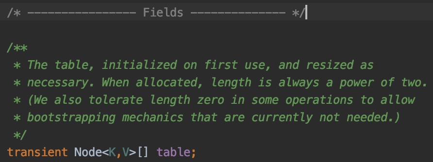
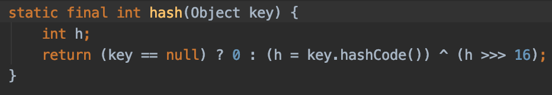

# Hashing
- 해싱은 검색트리 뿐만 아니라 Dynamic set을 구현하는 효과적인 방법중 하나이다.
- 평균 탐색, 삽입, 삭제의 시간복잡도는 O(1)
- 최악의 시간복잡도는 O(N)
- 해시 함수를 이용하여 해시 함수의 결과 값을 해시 테이블의 인덱스로 사용한다.
    - 해시 테이블을 하나의 큰 배열로 보면 된다.
    - 해시 함수 결과값을 key를 저장하는 해시 테이블의 배열 인덱스로 보면 된다. 
        - index = \[hashFunction(key)\];
    - 해시 함수를 사용하여 나온 결과값을 해시 테이블에 인덱스로 사용하고, 그 인덱스에 key를 보관한다.
        - hashTable\[hashFunction(key)\] = key;

## 해시 함수의 예
- 임의의 key를 하나의 자연수로 해석하고 해시 함수를 통해 사용한다.
    - 예로 문자열이 있을때, A의 아스키 코드값은 65인 예
- 보통 해시 함수의 간단한 구현은 다음과 같다.
    - hashFunction(key) = key % M (테이블 크기)
- 물론 해시 함수는 복잡하다. 하지만 해시 함수의 결과값은 항상 0 ~ M - 1 사이이다.

<br>

## 충돌 (Collision)
- 만약 서로 다른 숫자인데 해시 함수의 결과값이 같으면 어떻게 되는가?
- 두개 이상의 key가 동일한 위치로 해싱 되는 경우를 `충돌`이라고 한다.
    - 서로 다른 두 키가 같은 인덱스를 참조하는 상황
- 일반적으로 데이터 집합이 Hash Table 크기보다 크므로 발생할 수 밖에 없다.
    - 배열의 크기를 무한대로 잡을 수 없으니!
- `충돌`이 발생할땐 어떻게 대처해야할까? 2가지 방법이 존재한다.

## 1. Seperate Chaining (분리 연결법)에 의한 충돌 해결
- `충돌`이 발생하는 이유는 하나의 인덱스에 하나의 key만 저장되기 때문이다.
    - 그렇다면 하나의 인덱스에 여러 key를 저장 한다면 어떨까?
- `Seperate Chaining`은 각 인덱스에 직접 key를 가지지 않고 **해당 인덱스에 대응되는 모든 key들을 하나의 연결 리스트로 만들어서 관리하여 해결하는 방법이다.**
- Hash Table 에는 key가 아닌 연결리스트의 첫번째 노드를 저장하도록 한다.
- 이 방법으로 충돌이 해결된다면 검색, 삽입, 삭제는 어떤 변화가 생기나?

### 1.1 Seperate Chaining시 삽입, 삭제 검색 시간복잡도
- 검색 : 연결 리스트의 순차 검색.
- 삽입 : key를 리스트 맨 앞에 삽입한다면 O(1) BUT, 중복 key의 저장을 허용하지 않는다면 리스트 검색 후 삽입해야 되기 때문에 시간 복잡도는 연결 리스트 길이에 비례한다.
- 삭제 : 키를 검색하고나서 삭제시 O(1)

### 1.2 Seperate Chaining의 최악의 경우
- 모든 키가 하나의 인덱스에 해싱되는 경우이다. (like 사향 트리)
- 길이가 N인 리스트가 만들어지므로 시간 복잡도는 O(N) + 해시 함수의 계산 시간
- 데이터 집합의 크기와 해시 테이블 크기 관계에 의해 최악을 피하긴 힘들다.
- 평균적인 시간복잡도를 가지려면 여러 인덱스에 얼마나 잘 분배되는지에 의해 결정된다.

### SUHA (Simple Uniform Hashing Assumption)
- 보통 해싱에 대해 이야기를 하면 SUHA를 가정하고 이야기를 한다.
- SUHA란 여러개의 key가 모든 인덱스에 균등한 확률로 해싱된다는 가정이다.
    - \[0\]에 1/m 확률로 key 해싱, \[1\]에 1/m 확률로 key 해싱, \[M - 1\]에 1/m 확률로 key 해싱
- 해당 가정은 성능 분석을 위해 주로 하는 가정이지, 현실적으로 불가능한 가정이다.
    - hash함수는 랜덤함수가 아니라 특정키에 해시값은 결정되어져 있기 때문
- 만약 SUHA 가정이 성립한다고 하면 각 인덱스에 저장된 key의 평균 갯수, Load Factor(초기 용량, 부하율)를 N / M 이라고 정의할 수 있다.
- 평균 검색 시간은 O(1)

<br>

## 2. Open Addressing (개방 주소법)에 의한 충돌 해결
- `Seperate Chaining` 처럼 연결리스트로 저장하지 않고, **모든 키들을 Hash Table에 저장하며, 하나의 인덱스에는 하나의 key만 저장하도록 하는 방법이다.**
- 충돌이 생긴다면 해시함수에 의해 얻어진 해당 주소가 아닌 **다른 빈 인덱스로 이동 후 key를 저장하여 충돌을 해결하는 방법이다.**
- Open Addressing은 내부적으로 충돌 해결 방법들이 존재하는데 대표적으로 4개가 존재한다.
    - Linear Probing
    - Quadratic Probing
    - Double Hashing
    - Rehashing

### 2.1 Linear Probing
- 가장 기본적인 방법으로써, **이동할 주소를 고정적인 폭을 가지고 선형 이동을 한다.**
- 즉, 해싱한 인덱스에서 저장된 key가 없다면 저장, 충돌이 된다면 다음 주소로 이동하여 저장하는 방법이다.
- 계속 반복하며 이동하는 방법으로, 테이블 끝에 도달하게 되면, 다시 처음으로 이동하는 연속적인 방법.

#### 2.1.1 Linear Probing의 단점
- key가 연속적으로 이동하면서 저장되기 때문에 key가 특정 구역에 응집되어있는 현상이 생기게 된다. 이걸 `클러스터링`이라고 한다.
- 이렇게 되면 연결리스트가 커지는 것과 같은 현상이 생기게 되며, 결국 원래 저장 되어야할 위치에서 멀어져서 저장되는 단점이 존재한다.
- Linear Probing의 단점을 극복한 방법들은 다음과 같다.
    - Quadratic Probing
    - Double Hashing
    - Rehashing

### 2.2 Quadratic Probing
- 제곱 탐사라고 불리며 선형 탐사가 고정폭만큼 주소를 이동했다면 이동 폭을 *연속된 주소가 아닌 제곱수*로 이동한다.
- h(key), h(key) + 1<sup>2</sup>, h(key) + 2<sup>2</sup> + ...
- 이동폭이 커졌을뿐 클러스터링이 완화되었다고 보긴 힘들다.
- **`규칙적인 이동 폭을 가지기 때문`**
- 규칙성을 없에고 불규칙한 이동폭을 가지도록 고안한 방법은 다음과 같다.

### 2.3 Double Hashing
- 클러스터를 제대로 방지할 수 있는 방법은 탐사할 주소의 규칙성을 제거하여 불규칙하도록 이동하는 것이다.
- 이중 해싱이라 하며, `서로 다른` 두개의 해시 함수를 이용하여 불규칙한 이동폭을 가진 방법이다.
- 하나의 해시 함수의 결과값에 충돌이 발생하면 다른 해시 함수를 이용해 이동폭을 얻어 이동하는 방법이다.
    - h(key, i) , i = 시도 횟수
    - h1(key) + (h2(key) * i)
    - 시도 횟수가 0이라면(i == 0) 다른 해시 함수는 사용하지 않게 된다.

### 2.4 ReHashing
- 결국 남은 공간이 별로 없는 해시 테이블이라면 충돌이 많이 발생하게 된다.
- 재해싱은 해시 테이블의 크기를 늘리고, 늘어난 해시 테이블의 크기에 맞게 테이블 내의 모든 key를 다시 해싱하는 방법이다.
- 해시 테이블의 공간 사용률이 평균 70 ~ 80% 가 되면 성능 저하가 나타난다고 하므로, 해당 사용률이 되기 전에 재해싱을 해야 효율적이다.
 
 
### 2.5 Open Addressing의 key 삭제
- 위에서의 설명은 대부분 insert나 search에 관련된 내용이다.
- key 삭제를 하게되면 조금 복잡해진다.
- 예로
    ```
    1, 2, 3이라는 key값들이 순서대로 해시 테이블의 인덱스 [0], [1], [2]에 저장된다고 가정했을때,
    2를 삭제 한 후 3을 검색하는 경우, Linear Probing을 했을 경우 빈 인덱스에 도달하면 검색이 종료되기 때문에 검색에 문제가 생기게 된다.
    
    삭제된 index에 마킹을 하는 방법도 고려해볼 순 있지만, Dynamic Set은 데이터가 동적으로 삽입, 삭제가 빈번하게 일어나므로 최악으로 모든 index가 
    Delete 마킹으로 채워질 수 있다. 그렇게 된다면 검색시 계속 검색하게 되고 적당한 지점에서 stop을 할 수 없는 문제가 존재한다.                          
    ```
- 적절한 해결책은 삭제한 인덱스에 존재했던 key와 같은 해시값 or 근접한 해시 값을 가지는 클러스터의 마지막 index의 key값을 옮기는 방법이 있다.

<br>

## 좋은 해시 함수란 무엇일까?
- 키들이 특정한 \[규칙, 공통점, 패턴\]을 가지더라도 해시 함수 값은 불규칙하게 되도록 하는게 바람직한 해시 함수이다.
    - ex) 학번, 주민등록 번호
- 해시 함수 값은 key의 특정 부분에 의해 영향이 없어야하고, key의 모든 부분이 해시 함수 값을 결정하는데 골구로 적용되어야 한다.
- 해시함수가 내부적으로 사용하는 방법을 간단하게 알아보자.

### Division 기법
- key를 해시 테이블 사이즈로 나눠 나머지를 이용하는 방법이다.
    - 해시 테이블보다 큰 수를 해시 테이블 크기에 범위에 들어오도록 수축시킴
- 일반적으로 해시 함수들이 마지막 Step에서 사용하는 과정이며, 해시 테이블 사이즈는 소수로 설정한다.
    - h(key) = key % m
- 장점 : 빠름
- 단점 : 해시 테이블 사이즈 값에 대해 해시 함수가 특정 부분에 의해 결정되는 경우가 존재할 수 있다.
    - m = 2<sup>x</sup>, key의 하위 x비트 일 뿐이므로 m은 2의 거듭 제곱이된다면 값이 정해지는 경우가 있다.
        - 어떤 key를 2<sup>x</sup>로 나눈 나머지는 항상 하위 x비트가 된다.

### Multiple 기법
- Division 방법과 반대이다.
    - 먼저 0 ~ 1 사이의 소수를 선택한다. (0 < A < 1)
    - key * A 한다음 정수를 버리고 소수부분만을 택한다.
    - 소수 부분에 해시 테이블 크기 m을 곱하여 소숫점을 버려 0 ~ m - 1 사이로 팽창시키는 방법.
- 예 m = 7, key = 21
    - A 선택 : 13 / 32 ( 0.3...)
    - key * A = 21 * 13 / 32 = 273 / 32 = 8 + 17 / 32
    - 정수를 버리고 (8) 소수를 선택 (17/32) -> h(key) = m * (key * A mod 1)
    - 7 * 17/32 = 3.xxxx 
    - 즉 h(21) = 3
 - 두 개의 키가 매우 유사할지라도 결과적으로는 유사성이 없어진다.
 - Division, Multiple 등의 기법등을 통해 해시함수가 키의 규칙성을 무시하고 불규칙하게 만들 수 있다.
 
### 자바에서의 Hashing
 - Java의 최상위 Object 클래스는 hashCode()를 가지고 있다.
    - 이 메서드는 하나의 32비트 정수를 반환한다.
    - 32비트 정수라는 것은 음수일 수도 있다.
- x.equals(y)라면, x.hashCode() == y.hashCode();
    - 역은 성립 X, x.hashCode() == y.hashCode() 라면 x.equals(y)
    - 8 % 10 = 8, 18 % 10 = 8, 8 == 18 ?
- 보통 hashCode() 매서드는 객체의 메모리 주소를 반환하는것으로 알려져있지만 X
    - 주소값 = 메모리상에 객체가 저장된 위치
    - hashCode = 객체를 구분하기위한 정수값
- 필요에따라 각 클래스는 이 메서드를 override를 하여 사용
```java
public final class String {
    private final char[] s;
    @Override
    public int hashCode() {
        int hash = 0;
        for (int i = 0; i < length(); i++) {
            hash = s[i] + (31 * hash); // 31진수인것처럼 사용
        }
        return hash;
    }
}
```
- h(s) = (s<sub>0</sub> * 31<sup>length - 1</sup>) + .... + (s<sub>length -1</sub>) * 31<sup>0</sup>

### hashCode와 hash 함수
- hashCode : -2<sup>31</sup> ~ 2<sup>31</sup> 사이의 정수
    - 이 해시코드 값을 바로 hash 함수의 결과값으로 사용하는게 아닌 hash함수를 통해 배열 인덱스로 변환해야한다. 
- hash 함수 : 0 ~ 해시테이블 크기 사이의 정수
```
private int hash(Key key) {
    return (key.hashCode() & 0x7fffffff) % M;
    // 0x7fffffff -> 양수, 음수 변환을 위한 작업
}
```
- 자바에서 사용하는 해시함수와 암호학에서 사용하는 해시는 구현이 다르기 때문에 구별해야한다.

### Java 8 HashMap
- 내부적으로 하나의 노드 배열을 해시테이블로 사용한다.
        
- 해시 함수는 위에서 설명한것과 유사한 방법으로 되어있다. 
    
    - Java 8 HashMap 보조 해시 함수는 상위 16비트 값을 XOR 연산하는 매우 단순한 형태의 보조 해시 함수를 사용한다. 
    - Java 8에서는 해시 충돌이 많이 발생하면 링크드 리스트 대신 트리를 사용하므로 해시 충돌 시 발생할 수 있는 성능 문제가 완화되었기 때문이다.
    - 해시 함수는 균등 분포가 잘 되게 만들어지는 경향이 많아, Java 7까지 사용했던 보조 해시 함수의 효과가 크지 않아 ava 8에서는 보조 해시 함수의 구현을 바꾸었다.
- 충돌 해결은 Chaining으로 해결한다.
    - Open Addressing은 HashMap에서 remove() 메서드는 매우 빈번하게 호출될 수 있다.
    - HashMap에 저장된 키-값 쌍 개수가 일정 개수 이상으로 많아지면, 일반적으로 Open Addressing은 Separate Chaining보다 느리다
- load factor를 지정할 수 있다. ( 0 ~ 1 사이의 실수)
    - 해시 테이블의 초기 용량, 퍼센트라고 생각하면 된다.
    - 저장된 키의 갯수가 load factor를 초과하면 더 큰 테이블을 할당하고 rehashing한다.
    - key 갯수 > 테이블 크기 * loadfactor
- 8 이전에 hashMap의 get 호출에 대한 기대값은 N/M인데, 8에서는 logN/M을 기대할 수 있다.
- 데이터 갯수가 많아지면 링크드 리스트 대신 트리를 사용하기 때문이다.
- 해당 버킷에 있는 데이터 갯수가 8개가 되면 링크드 리스트를 트리로 변경하고, 데이터 삭제를 통해 6개가 된다면 다시 링크드 리스트로 변경한다.
    - 이때 사용하는 트리는 Red-Black Tree를 사용한다.
