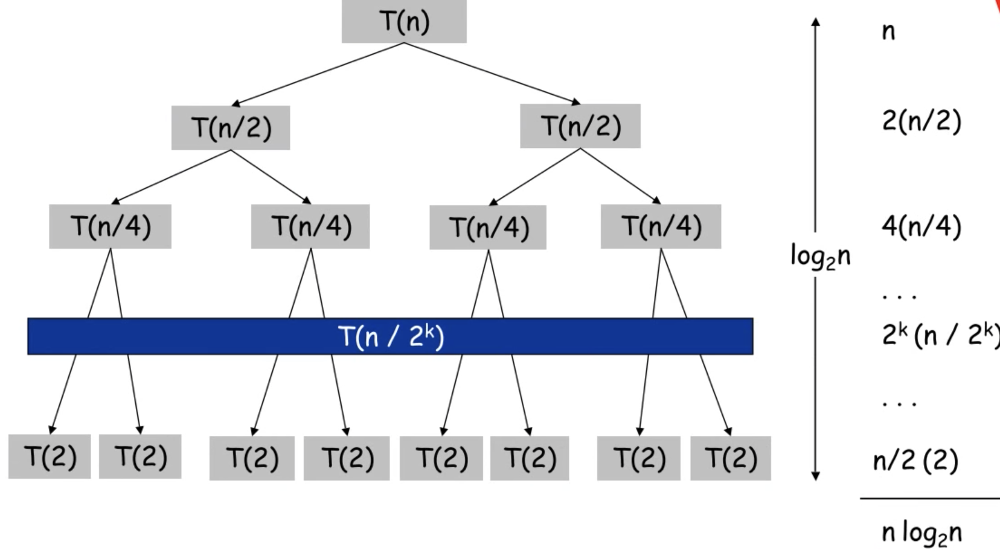

# Merge Sort
- 합병 정렬을 설명한다.
- 합병 정렬을 구현한다.
- 합병 정렬의 시간복잡도와 공간복잡도를 계산할 수 있다.

### 합병 정렬 설명
- 분할 정복 방법을 구현한 정렬 방법.
- 분할 : 해결하고자 하는 문제를 작은 크기의 **동일한** 문제들로 **분할**
- 정복 : 각각의 작은 문제를 `순차적`으로 해결
- 합병 : 작은 문제들의 결과를 합하여 궁극적인 결과를 구함.
- 즉, 큰 문제를 더이상 나누어지지 않을때까지 절반씩 분할하다가 나누어지지않을 작은 원소하나부터 비교하여 merge해가는 방식.

### 합병 정렬 시간 복잡도, 공간 복잡도

- N개의 데이터를 mergeSort 하는데에 걸리는 시간을 T(n)이라고 가정하면
- T(n) = T(n/2) + T(n/2) + N = 왼쪽 절반 비교 횟수 + 오른쪽 절반 비교 횟수 + Merge = 2T(N/2) + N
- 시간 복잡도 : O(N * logN) : 데이터 크기 (N) * 데이터가 분할되는 횟수(logN) 

- merge시 임시 배열이 필요하기 때문에 자료의 수 N 만큼 추가 공간이 필요하다.
    - 공간 복잡도 : O(N)
    
### 합병 정렬의 예
- 합병 정렬은 순차적인 비교로 정렬을 진행하므로 `LinkedList`를 정렬할 때 효율적이다.
- `LinkedList` 정렬시 임의 접근을 하는 정렬들을(Quick Sort) 사용하게 되면 순차 접근을 하게되어 오버헤드가 발생하게 된다.
- `LinkedList`는 처음 Head 부터 순차적으로 탐색 해야하기때문에 O(n) 이다.

### 합병 정렬 문제점
- 재귀로 할 경우 배열이 아주 클 경우 Stack Overflow 발생할 수 있다. 비재귀 방법으로 해결한다.
