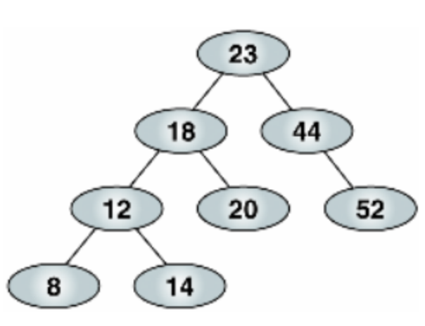

# AVL 트리
- Binary Search Tree는 `저장 순서`에 따른 탐색의 성능에 큰 차이를 보인다.
- 한쪽 방향으로 쏠려있는 편향 트리 같은 구조는 탐색시 자료수에 비례하게 되어 BST 장점을 살릴 수 없다. 
- 이런 단점을 보호하고자 삽입, 추가시 트리의 균형 상태를 파악해서 스스로 구조를 변경하여 균형을 잡는 트리가 AVL 트리이다.
- 모든 노드의 왼쪽과 오른쪽 서브 트리의 높이 차이가 1이하 이다. <br>



<br>

## AVL 트리 높이
- 트리의 높이는 각 임의의 노드 기준으로 여러 경로가 존재할때 그 중 가장 깊이 뻗은 경로의 갯수이다.
```
         15                    
       /    \                       
      6      18                       
    /  \                          
   3    7                       
    \     \
     4     13    
             \
              14

15의 높이 = 4 
 6의 높이 = 3  
 7의 높이 = 2  
13의 높이 = 1  
14의 높이 = 0                
```
- pseudo
```
// 트리의 높이
getHeight(rootNode) {
    if (rootNode == null) {
        return 0;
    }
    
    leftHeight = getHeight(rootNode.left);
    rightHeight = getHeight(rootNode.right);

    if (leftHeight > rightHeight) {
        return leftHeight + 1;
    } else {
        return rightHeight + 1;
    }
}
```
```
// 트리의 높이 차
int getHeightDiff(rootNode) {
    if (rootNode == null) {
        return 0;
    }
    
    leftHeight = getHeight(rootNode.left);
    rightHeight = getHeight(rootNode.right);

    return leftHeight - rightHeight;
}
```

<br>

## 균형 인수
- 균형의 정도를 표현하기 위해서는 `균형 인수(Balance Factor)`를 사용한다.
- `균형 인수`란 **왼쪽 서브트리의 높이 - 오른쪽 서브 트리의 높이의 차**를 말한다.
- `균형 인수`의 절대 값이 크면 클수록 트리의 균형이 무너진 상태이다.
- AVL 트리는 `균형 인수`의 **절대값이 2이상인 경우 `재조정(Rebalancing)`** 을 진행한다.
```
         15                    
       /    \                       
      6      18                       
    /  \                          
   3    7                       
    \     \
     4     13    
             \
              14

15의 균형 인수 = 4 - 1 = 3
 6의 균형 인수 = 2 - 3 = -1
 7의 균형 인수 = 0 - 2 = -2
13의 균형 인수 = 0 - 1 = -1
14의 균형 인수 = 0              
```

<br>
<br>

### 1. 리밸런싱이 필요한 첫 번째 LL 상태와 LL 회전
- AVL 트리의 균형이 무너지는 상태는 4가지로 정리된다.
    - LL 상태 : Left Left
    - RR 상태 : Right Right
    - LR 상태 : Left Right
    - RL 상태 : Right Left
- 각 상태별 리밸런싱 방법도 차이가 있는데, 그 중 하나인 `LL상태`를 알아본다.
```
        5
      / 
     3
    /
   1    
```
- 현재 트리는 루트 노드의 균형인수가 왼쪽으로 +2 이다. => 왼쪽으로 노드가 두개 연이어 연결 되어 있다는 뜻
- 이런 상태를 `LL상태`라고 한다. 해당 상태를 해결을 위한 리밸런싱 방법은 `LL회전`이라 한다.
- Left Left 회전이 아닌 `LL상태`를 해소하고자 하는 회전이라고 불려 `LL회전`이라 한다.

### 1.1 LL 회전
- LL 회전의 핵심은 균형인수가 +2인 노드를 균형인수 +1인 노드의 오른쪽 자식으로 회전하는 방법이다.
```
        5               
      / 
     3         ---LL 회전--->          3
    /                               /   \
   1                               1     5
```
- 자세히 보면 Red-Black Tree에서 설명한 Right Rotation을 수행한다.
- 즉 LL 회전은 실제 Right Rotation을 수행한다.

<br>
<br>

### 2. 리밸런싱이 필요한 두번째 RR 상태와 RR 회전
- RR 상태는 LL 상태와의 반대 방향이다. 오른쪽으로 균형인수가 -2
- LL 상태가 왼쪽으로 길게 늘어진거라면 RR 상태는 오른쪽으로 길게 늘어진 것이다.
- RR 상태를 균형잡기 위한 회전은 RR 회전이라고 한다.
```
     5
      \ 
       7
        \
         9    
```

### 2.1 RR 회전
- RR 회전의 핵심은 균형인수가 -2인 노드를 균형인수 -1인 노드의 왼쪽 자식으로 회전하는 방법이다.
```
     5
      \ 
       7        ---RR 회전--->     7
        \                        /  \
         9                      5    9
```
- 자세히 보면 Red-Black Tree에서 설명한 Left Rotation을 수행한다.
- 즉 RR 회전은 실제 Left Rotation을 수행한다.

<br>
<br>

### 3. 리밸런싱이 필요한 세번째 LR 상태
- 자식 노드가 Left로 그리고 그 자식 노드의 Right로 달린 상태 
- 한번의 회전으로 LR 상태를 해결할 수 없다.
    - 한번의 회전만으로 균형을 못잡는다.
- LR 상태를 한번의 회전으로 LL or RR 상태로 바꾸고 해당 상태에 대한 회전을 수행한다.
```
     5
    / 
   1    
    \    
     3        
```

### 3.1 LR 회전
- 위에서 언급한 것 처럼 한번에 회전만으로 불균형을 해소할 수 없기에 LL or RR 상태로 바꾼다.
- 그런 다음 해당 상태에 대한 회전을 수행하여 불균형을 해소한다.
```
     5                               5
    /                               /    
   1        ---RR 회전--->          3         ---LL 회전--->     3
    \                             /                           /  \
     3                           1                           1    5
```
- 즉 LR 회전은 LL 회전과 RR회전으로 이루어져 있다.

<br>
<br>

### 4. 리밸런싱이 필요한 네번째 RL 상태
- LR 상태의 반대이다.

### 4.1 RL 회전
```
     1                            1
      \                            \    
       5     ---LL 회전--->          3         ---RR 회전--->        3
      /                              \                            /  \
     3                                5                          1    5
```

<br>
<br>

## Rebalance
- pseudo
```
rebalance(rootNode) {
    int diff = getHeightDiff(rootNode);
    
    // 균형 인수가 +2 이상이면 LL 상태 or LR 상태이다.
    // 왼쪽 서브 트리 방향으로 높이가 2이상 크다면
    if (diff > 1) {

        // LL 상태라면
        if (getHeightDiff(rootNode.left) > 0) {
            LLRotate(rootNode);
        } else {
            LRRotate(rootNode);
        }
    }
    
    // 균형 인수가 -2 이상이면 RR 상태 or RL 상태이다.
    // 오른쪽 서브 트리 방향으로 높이가 -2이상 이상이라면
    if (diff < -1) {
        // RR 상태라면
        if (getHeightDiff(rootNode.right) < 0) {
            RRRotate(rootNode);
        } else {
            RLRotate(rootNode);
        }
    }
}
```
