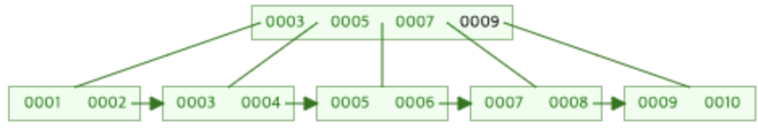

# B + Tree
- B-Tree의 확장 개념, 인덱스 구조에서 순차접근에 대한 문제에 대한 해결책


## B + Tree의 구성
- B-Tree의 경우, 내부 노드에 key-data를 담을 수 있다.
- B+Tree의 경우, **내부 노드에는 key만 담고 오직 리프 노드에만 key-data를 저장하고 리프 노드끼리 Linked List로 연결되어 있다.**


<br>

- Index Set : 키, 포인터만 존재한다.
    - 리프 노드에 있는 값들에 대한 키값으로써, 리프 노드에 있는 키 값을 찾아갈 수 있도록 경로 제공이 목적이다.
     
- Sequential Set : 실제 key - data가 존재한다.
    - **리프 노드에만 key-data 값을 가지고 있으며, 각 리프 노드들은 연결 리스트 형태로 연결되어 있어 순차 접근이 용이하다.**
    - B-Tree의 성능 저하 해결
    
## B + Tree의 특징
- 리프 노드를 제외한 내부 노드들에 데이터를 담지 않기 때문에 메모리를 더 확보함으로써 더 많은 key들을 담을 수 있다. 
    - 하나의 노드에 더 많은 key가 담겨 트리의 높이는 낮아진다.
- 탐색시, 리프 노드에 데이터가 있기 때문에 한 번의 선형 탐색만 하면 됨으로써 B-Tree보다 빠르다.
    - B-Tree는 데이터 검색시 모든 노드를 하향식으로 찾아야함.
- 삭제시, 리프 노드에서만 삭제하고 키 값은 Index Set에 유지한다.
    - 탐색시, 삭제되어 사용되지 않는 key들은 리프 노드를 찾기위한 separator 역할을 수행한다.
 
## B+Tree의 검색
- 리프노드를 제외한 트리 내부에 존재하는 노드들은 인덱스의 범위를 가진다.


<br>

- Infimim : 하한 값
- supremu : 상한 값 
- pseudo code
    ```
    serach(key, node) {
        if (node.childs == null) {
            return node;
        }
        
        if (k < min) {
            return search(key, getNodeLeftChild(node));
        } else if (k >= min && k < max) {
            return search(key, getMiddleChild(node));
        } else {
            return search(key, getRightChild(node)); 
        }
    }   
    ```
  
## B+Tree의 삽입
- B-Tree와 비슷하게 overflow가 되면 분할한다.
- **B-Tree의 삽입과의 차이점은 중간 키 값이 부모 인덱스 노드 뿐만 아니라 새로 분할된 노드에도 저장되는 것이다.**
    - 그 이유는 위에서 설명했듯이 어느 방향의 리프 노드로 갈건지에 대한 방향지시등 역할을 하기 위해 Index set, Sequential Set에 저장하고, <br>
    삭제시 리프노드에서만 삭제한다.
- **차수 M이 홀수일때, overflow가되어 분할시 부모로 올리는 값은 (M / 2) + 1 번째를 올린다.**
- 3차 B+Tree를 삽입해보자. 1, 2, 3을 insert한 상태에서 시작한다. [1, 2, 3]


- 4 삽입시, overflow가 발생하기 때문에, (3/2) + 1인 index 2번째 값인 3을 위로 올린다. 
    - 3을 부모 노드로 올리고 좌우로 노드를 분할한다.
    - 이때 부모 노드로 올리는 3은 리프 노드에 그대로 남기고 연결리스트 형태로 연결한다.


    
- 5 삽입후, 6 삽입시, (3/2) + 1인 index 2번째 값인 5을 위로 올린다. 
    - 5를 부모 노드로 올리고 좌우로 노드를 분할한다.
    - 이때 부모 노드로 올리는 5는 리프 노드에 그대로 남기고 연결리스트 형태로 연결한다.
    
    

- 7 삽입후, 8 삽입시, (3/2) + 1인 index 2번째 값인 7을 위로 올린다. 
    - 7을 부모 노드로 올리고 좌우로 노드를 분할한다.
    - 이때 부모 노드로 올리는 7는 리프 노드에 그대로 남기고 연결리스트 형태로 연결한다.
    


- 9 삽입후, 10 삽입시, (3/2) + 1인 index 2번째 값인 9을 위로 올린다. 
    - 9을 부모 노드로 올리고 좌우로 노드를 분할한다.
    - 이때 부모 노드로 올리는 9는 리프 노드에 그대로 남기고 연결리스트 형태로 연결한다.
    - 이때 부모 노드가 overflow가 발생하여 부모 노드중 (3/2) + 1인 index 2번째 값인 7을 부모를 루트 노드로 올리면서 각 노드로 분할한다.


<br>

## B+Tree의 삭제
- B-tree에서는 달리 B+tree는 leaf node에서만 삭제된다.
    - 삭제시, B+tree의 특징을 만족하면 Index Set에 있는 키 값은 삭제하지 않고 <br>
    삭제시, 만족하지 않아 병합을 해야되는 경우, Index Set에서도 키 값을 삭제한다.
- 1~10이 들어가 있는 B+tree에서 삭제연산을 해보자.
    - 2를 삭제할 경우, underflow가 발생하지 않으므로 2를 그냥 삭제할 수 있다.
    
    
    <br><br>

    - 1을 삭제할 경우, underflow가 발생하게 되어 형제노드 [3,4]를 확인한다.
        - 형제 노드[3,4]는 값을 빌려줄 여건이 되어 3을 빌려준다.
        - 이때 형제 노드에서는 3을 삭제한것과 같으므로 Index Set에서의 3을 제거하고 4로 대체로 한다.
    

    <br><br>
    
    - 3을 삭제할 경우, underflow가 발생하게 되어 형제노드 [4]를 확인한다.
        - 형제 노드는[4] 값을 빌려줄 여건이 되지 않기 때문에 부모 노드가 값을 빌려준다. (4)
        - 물려받은 4와 형제노드 4를 병합하고 Index Set에서의 4를 제거하고 5로 대체로 한다.
    
