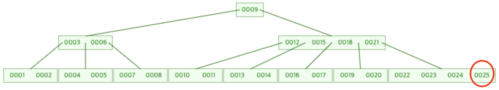

# B - Tree
- DB와 파일시스템에서 주로 사용되는 트리 자료구조
- Balanced - Tree or Bayer - Tree 라고 불리며 AVL Tree, Red Black Tree 와 같이 균형잡힌 트리이다.
- 이진 트리를 확장하여 **노드에 더 많은 자식 노드들을 가지도록 고안한 트리**
- 대량의 데이터를 처리해야하는 검색 구조에서 큰 장점을 가지고 있다.
    - 만약 대량의 데이터를 검색해야되면 높이를 타고 내려가 자료를 일일이 비교하기엔 비효율적이다.
    - 내부 노드의 자식노드의 갯수를 최대화함으로써, 트리의 높이는 감소하고 리밸런싱은 덜 일어나 효율적이다.
         
## B - Tree를 인덱스 자료구조로 사용하는 이유
- 디스크 I/O의 기본단위는 블록이다.
    - 디스크로부터 데이터를 읽거나 기록할때 디스크 블록 전체를 메모리로 읽어오고 다시 전체를 디스크에 기록하는 방식으로 I/O가 일어난다.
- 디스크에 접근하는 것은 메인 메모리의 접근에 비해 엄청난 시간이 든다.    
- 데이터가 대량이라면 메모리에 모두 올려놓고 사용할 수 없다.
    - 즉 검색 트리가 디스크에 있는 상태에서 작업을 해야하는 상황이 발생한다.
- 디스크의 느린 I/O를 수행하기 위해서는 색인(index) 구조가 필요하다.
    - 보조 기억 장치에서의 탐색은 시간적인 부하가 많으므로 탐색을 위해 file과 index를 별도로 생성하여 사용한다.
- 대량의 데이터는 보조 기억 장치인 메모리보다 외부 기억 장치들인 HDD, SSD에 저장하는데, 블럭 단위로 입출력을 한다.
    - 한 블럭이 1024 바이트라면, 2 바이트를 읽으나 1024 바이트를 읽으나 입출력에 대한 비용은 동일하다.
- B-tree의 각 노드는 디스크의 블록과 같기 때문에 노드 하나 접근하는것을 디스크 전체를 한번 더 접근하는것을 의미하므로 <br>
  하나의 노드를 1024바이트가 되도록 조절하여 적은 수의 노드를 생성하여 최대한 적게 접근하도록 하여 입출력 면에서 매우 효율적인 구성이 된다.
        
<br>

## B - Tree의 특징
- 한 노드의 M개의 자료가 배치되면 M차 B-tree 라고 한다.
- 차수가 M인 B 트리는 다음 속성들을 만족시켜야 한다.
- 규칙 1.
    - **노드의 데이터수가 N 개라면, 자식 노드의 갯수는 N + 1개를 가져야한다.**
        ```
               [ 1, 2, 3 ]      // 3개의 데이터
              /   |    |   \
           [  ] [  ] [  ]  [  ] // 4개의 자식노드
        ```
    - 노드에 담긴 데이터는 정렬된 상태여야 한다.
        - [ 3, 1, 2 ] ( X ), [1, 2, 3] ( O )
    - 노드의 자식 노드의 데이터는 부모 노드 데이터 기준으로 배치된다.
        - 부모 데이터보다 작으면 왼쪽
        - 부보 데이터들의 사이값이면 중간
        - 부모 데이터보다 크면 오른쪽
        ```
                [ 8, 13 ]
               /    |    \
        [1, 2, 6]  [9]   [14, 15]
        ```
- 규칙 2.
    - Root 노드에게 자식이 있다면 최소 2개이상이여야 한다.
    - Root 노드를 제외한 모든 노드들은 적어도 `M차 / 2개`의 데이터를 가져야 한다.
        ```
           3차 B-tree라면, 각 자식 노드들은 최소 1개씩 데이터를 가지고 있어야 한다.
                    [ 8, 13 ]
                   /    |    \
            [1, 2]    [9]   [14, 15]
        
           4차 B-tree라면, 각 자식 노드들은 최소 2개씩 데이터를 가지고 있어야 한다.
                    [ 8, 13 ]
                   /    |    \
            [1, 2,]  [9, 10]  [14, 15]
        ```
    - 리프 노드로 가는 경로의 길이는 모두 같다.
        - 리프 노드는 모두 같은 레벨에 존재해야 한다.
    - 입력된 자료는 중복이 될 수 없다. - key를 저장하기 때문

## 탐색
- 일반적인 이진 탐색 트리와 동일하다.

## 삽입 
- 차수가 홀수, 짝수에 따라 알고리즘이 다르다.
- 자료는 항상 leaf 노드에 추가된다.
1. 추가될 leaf 노드에 여유가 있다면 그냥 삽입
2. 추가될 leaf 노드에 여유가 없다면 분할.
    1. 정렬된 값들을 기준으로 중간값을 부모노드로 올린다. (Upward Split)
    2. 중간값을 위로 올리고 남은 노드들을 중간값을 기준으로 중간값보다 작은 값은 왼쪽, 큰값은 오른쪽으로 각 노드로 나눈다.
    3. 중간값은 부모가 되는데 만약 또 부모 노드가 꽉차면 반복적으로 트리를 타고 올라가며 진행한다.
        - 루트 노드를 분리했다면 새로운 루트 노드를 생성한다.

## 삭제
- 삭제할 노드가 리프 노드, 리프 노드가 아닌 경우인 2가지로 나뉜다.
- Case 1. 리프 노드일 경우
    - 노드에서 데이터를 삭제해도 B-tree의 조건을 충족하면 삭제한다. (모든 노드의 자료 갯수가 M / 2개 이상인지)
    - 만약 삭제시 B-tree 구조가 깨지게 된다면 **형제 노드에게 빌리거나 결합을 해야한다.**
    - 빌릴시 : 
        - 형제가 오른쪽 서브트리라면 가장 작은 값을 부모에게 올리고 부모의 값을 삭제한 노드쪽으로 내린다.
        - 형제가 왼쪽 서브트리라면 가장 큰 값을 부모에게 올리고 부모의 값을 삭제한 노드쪽으로 내린다.
    - 결합시 : 빌릴때, 형제도 B-tree의 조건을 만족하지 못할 경우, 부모의 값을 내려 형제 노드와 삭제한 노드와 결합한다.
    
- 5차 B-tree가 다음과 같이 있다고 가정할때 <br>
    
    - 25시 삭제시 b-tree 조건을 만족하기 때문에 바로 삭제 가능

<br>

- 형제에게 빌릴 경우
    - 20을 삭제하는 경우 
    
    
    <br>
    
    - 20삭제시 b-tree의 조건을 만족하지 않기때문에 오른쪽 형제에게 22값을 빌려 부모에게 전달 후 부모에 값 21을 내려 받는다.
    
    
- 형제와 결합할 경우
    - 21을 삭제할 경우
    
    
    <br>
    
    - 21삭제시 b-tree의 조건을 만족하지 않고, 왼쪽과 오른쪽 형제들에게도 빌릴 수 없기 때문에 부모의 값 18을 내려 받고 왼쪽 형제와 결합한다.
    
        
    <br>
<br>

- Case 2. 내부 노드일 경우
    - 대체키를 찾는다. (선행자 or 후행자)
    - 삭제하려는 키를 대체키로 바꾸는 과정을 Case 1을 이용해 처리한다.
    
- 내부노드 12 삭제할 경우
    
    - 12의 선행자 11을 대체키로 하여 갖고온다.
    
    
    <br>
    
    - 선행자를 갖고온 10이 있는 노드가 b-tree 조건을 만족하지 않기 때문에 Case 1에 해당하게 된다.
    - 오른쪽 형제에 값을 빌릴 수 없기 때문에 다시 부모의 값 11을 내려받아 형제와 합친다.
    
    
    <br>
    
- 내부 노드 6을 삭제할 경우
    
    
    <br>
    
    - 6의 선행자 5를 대체키로 하여 갖고온다.
    
    
    
    <br>
    
    - 선행자로 갖고온 5가 있는 노드의 갯수가 b-tree 조건을 만족하지 않기 때문에 Case 1에 해당하게 된다.
    - 왼쪽 형제에게 빌릴 수 없기 때문에 결합을 해야되는 상황이 발생한다.
    - 부모에게 3을 내려받고, 왼쪽 형제와 합친다.
    
    
    
    <br>
    
    - 부모 노드의 갯수가 b-tree를 충족하지 않기 때문에 부모 노드의 부모(루트)에게 값을 내려 받고 형제와 결합한다.
    
    

    <br>

### B - Tree의 단점
1. 각 노드의 공간 활용성이 낮다.
    - 최대 차수가 M이라면 평균적으로 각 노드는 M / 2 정도의 키 값만 가지고 있는 경우가 많다.
2. 데이터의 순차 검색을 지원하지 않는다.
    - 연속되는 여러 데이터들을 검색해야할때, 각 데이터들을 검색할때마다 루트에서부터 검색 해야한다.
