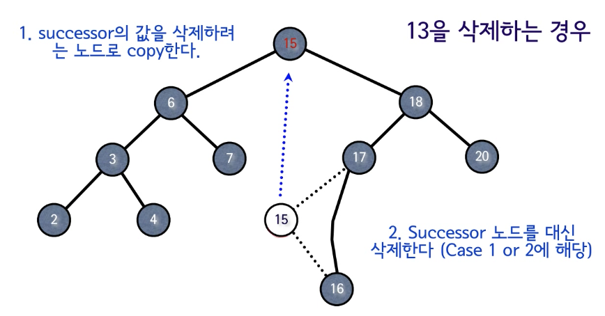

# 이진탐색트리 (Binary Search Tree)
- 일반적인 트리는 계층적인 구조를 가질때 사용한다.
- 이진검색트리는 계층적인 구조라기보다는 다이나믹 집합으로 사용한다.
    - Dynamic Set : 고정적이지 않은 데이터들을 추가/삭제 해서 계속 변하는 집합
- insert, search, delete 3가지 연산을 효율적으로 지원한다.
- 탐색 구조로 주로 배열이나 연결리스트를 사용한다.

| |Search|Insert|Delete|
|---------------|----------------|-----------------------|-------------------------|
|배열 정렬        |이진검색 `O(logN)`|데이터 이동으로 인해 `O(N)`|삭제 후 이동 `O(N)`         |
|배열 정렬 x      |순차검색 `O(N)`   |맨마지막에 `O(1)`        |검색 후 삭제 `O(N)`         |
|연결리스트 정렬   |단방향검색 `O(N)`  |단방향진입 `O(N)`        |검색 후 삭제 `O(N)`         |
|연결리스트 정렬 x |단방향검색 `O(N)`  |데이터 이동없이 끝에 `O(1)`|검색 후 삭제 `O(N)`         |
    
- 이 두 자료구조를 사용할 경우 INSERT, SEARCH, DELETE 중 적어도 하나는 `O(n)`의 시간복잡도를 가진다.
- 어떻게하면 Search, Insert, Delete를 효율적으로 할 수 있을까 ?
    - 탐색 트리 구조인 다이나믹 집합을 구현한다.
    - 이진탐색트리(Binary Search Tree), 레드-블랙 트리, AVL 트리, B 트리 
    - 해시 

<br>

## 검색 트리
- 다이나믹 데이터 집합을 트리 형태로 구현한 것
- '계층적인 구조면 트리를 사용 해야지'가 아닌 '유동적인 데이터 집합이라면' '트리를 통해 구현할 수 있겠다' 라고 생각하자.
- 위 3가지 연산을 **높이에 비례하는 시간 복잡도를 가진다.**

<br>

### 이진 검색 트리 (BST)
- 이진 트리이면서 각 노드에 하나의 데이터(키)를 저장한다.
- **각 Center 노드에 대해서 노드의 왼쪽 서브트리에 있는 키들은 Center보다 작거나 같고 <br>
오른쪽 서브트리에 있는 키들은 같거나 크다.**
```
    5                       2
   / \                       \
  3   7                       3
 / \  / \                      \
2  5 1   8                      7
                               /  \
                              5    8
                             /
                            5
```

### 1. Search
- 시간 복잡도 : O(h) -> 트리의 높이에 비례
- pseudo
    - recursive
        ```
        search(node, target) {
            if (node == null || target = node.data) {
                return node;
            }
             
            if (target < node.data) {
                return search(node.left, target);
            }
            return search(node.right, target);
        }
        ```
    - iterative
        ```
        search(node, target) {
            while(node != null && target != node.data) {
                if (target < node.data) {
                    node = node.left;
                } else {
                    node = node.right;
                }
            }
             
            return node;
        }
        ```
<br> 

- 최소값 찾기 : 최솟값은 항상 왼쪽 노드에 존재한다.
    - 시간 복잡도 : O(h)
    - pseudo
        ```
        min(node) {
            while (noe != null && node.left != null) {
                node = node.left;
            }
             
            return node;
        }
        ```

<br> 

- 최대값 찾기 : 최대값은 항상 오른쪽 노드에 존재한다.
    - 시간 복잡도 : O(h)
    - pseudo
        ```
        max(node) {
            while (noe != null && node.right != null) {
                node = node.right;
            }
             
            return node;
        }
        ```

<br>

#### 후행자 (Successor)
- 노드 x의 데이터보다 `크면서 그 중 가장 작은 값`을 가진 Node
- 시간 복잡도 O(h)
- Successor 3가지 경우
    1. 노드 X의 오른쪽 서브트리가 존재하면 오른쪽 서브트리의 최소값이 Successor
    2. 오른쪽 서브트리가 없는 경우 어떤 노드 Y(6)의 왼쪽 서브 트리의 최대값이 X(4)가 되는 노드가 Successor
        - 부모를 따라 올라가면서 처음으로 부모의 왼쪽노드 링크를 타게 된다면 Successor라는 소리
    3. Successor가 존재하지 않는 경우는 x가 최대값이라는 뜻
```
         15                       
       /    \                       
      6     18                       
     / \    / \                      
    3   7 17                      
     \   \
      4   13

15의 Successor = 17                       
 6의 Successor = 7                       
 4의 Successor = 6                       
13의 Successor = 15                       
```

- pseudo
```
successor(node) {
    ParentNode parentNode = null;

    if (node != null && node.right != null) { // 1.
        return min(node.right);
    }

    parentNode = node.parent;
    // 2. 부모의 오른쪽과 현재 노드가 동일하니?
    while (parentNode != null && node == parentNode.right) { 
        node = parentNode;
        parentNode = node.parent;
    }
    // while문을 벗어난다는건 left 링크라는 소리 == successor
    return parentNode; // 3.
}
```

<br>

#### 선행자 (Predecessor)
- 노드 x의 데이터보다 `작으면서 그 중 가장 큰 값`을 가진 Node
- Successor와 대칭
- 시간 복잡도 O(h)
- pseudo
```
predecessor(node) {
    ParentNode parentNode = null;

    if (node != null && node.left != null) { // 1.
        return max(node.left);
    }

    parentNode = node.parent;
    // 2. 부모의 왼쪽과 현재 노드가 동일하니?
    while (parentNode != null && node == parentNode.left) { 
        node = parentNode;
        parentNode = node.parent;
    }
    // while문을 벗어난다는건 right 링크라는 소리 == predecessor
    return parentNode; // 3.
}
```

<br>

### 2.Insert
- Insert 연산시 기존의 노드들의 위치는 변경되지 않는다.
- 구현을 위해 2개의 변수를 사용한다. (x, y)
- x가 null이 되버리면 데이터 보존이 되지 않기 때문에 x의 한칸 뒤에는 y가 따라오도록 한다.
- 14의 삽입 위치를 찾으러 13의 오른쪽으로 내려갔는데, x의 위치가 null이 되므로 y가 항상 x의 부모 노드를 관리해 준다.
```
         15                       
       /                         
      6                            
       \                          
        7                       
         \
          13                    
```
- pseudo
```
insert(tree, newNode) {
    x = rootNode;
    y = null; // y = x of parent;

    while (x != null) {
        y = x;
        if (newNode.data < x.data) {
            x = x.left;
        } else {
            x = x.rightl
        }
    }

    newNode.parent = y;
    if (y == null) { // while문을 한번도 실행하지 못하면 emptyTree라는 
        tree.rootNode = newNode;
    } else if (newNode.data < y.data) {
        y.left = newNode;
    } else {
        y.right = newNode;
    }
}
```

<br>

### 3. Delete
- 사전 작업으로 특정하느 노드를 찾고 특정한 노드를 삭제한다.
- 삭제시 3가지 케이스를 고려한다.
    - Case 1 : 삭제할 노드의 자식 노드들이 없는 경우
        ```
             5                       
            / \                       
           3   7                       
          / \  / \                      
         2  5 1   8(d)
        
        삭제할 노드가 부모노드의 오른쪽 자식 노드라면, 부모노드의 오른쪽 자식을 null로 만든다.
        삭제할 노드가 부모노드의  왼쪽 자식 노드라면, 부모노드의 왼쪽 자식을 null로 만든다.                      
        ```
    - Case 2 : 삭제할 자식 노드가 1개 있을 경우
        ```
              5                       
            /   \                       
           3     7(d)                       
          / \   /                      
         2  5  1(child)
        
        삭제할 노드의 자식 노드를 해당 위치로 올린다.
        연결리스트에서 가운데 노드를 삭제한것과 같다.                               
        ```      

    - Case 3 : 삭제할 자식 노드가 2개 있을 경우 <br>
    
    - 만약 트리의 규모가 크다고 할때 삭제할 노드(13)를 삭제하게 된다면 다른 서브 트리의 구조를 옮겨야 하기 때문에 복잡해지므로 노드를 그대로 두고 데이터만 변경한다. 
    - 어떤 데이터를 가져와야 효율적일까? => 이진 탐색 트리의 특징을 이용하여 **가장 가까운 값**을 갖고오도록 한다.
        - `선행자` or `후행자` => 삭제할 노드의 가장 근접한 값들
    - `선행자` or `후행자`를 가지고오면 장점
        1. 대칭되는 서브 트리의 영향이 없음.
        2. 데이터들의 크기 관계과 훼손되지 않음.
        3. `선행자`, `후행자`의 특징은 한쪽 방향으로 자식이 없는 애들.
            - 즉 `선, 후행자`의 자식은 0개이거나 1개이므로 case 1 or case 2에 해당된다.                         
- 시간 복잡도 : O(h)
- pseudo

```
delete(tree, target) {
    // 자식 노드가 0개이거나 1개라면
    if (target != null && (target.left == null || target.right == null) {
        // 실제로 삭제할 temp 변수에 옮긴다.
        temp = target;
    } else {
        // 자식 노드가 2개라면 후행자를 찾는다.
        temp = successor(target);
    }

    /* 
        temp의 자식을 체크하는 이유는 temp가 삭제가 될것이기 떄문에
        temp의 자식을 temp 위치로 옮겨 temp의 부모와 연결하기 위함
    */
    if (temp.left != null) { 
        child = temp.left;
    } else {
        child = temp.right;
    }

    if (child != null) {
        child.parent = temp.parent;
    }

    // 삭제할 부모 노드의 자식 링크들을 변경하는 부분
    if (temp.parent == null) { // temp가 루트노드라면 
        tree.rootNode = child;
    } else if (temp.parent.left == temp) { // 삭제할 노드가 삭제할 부모의 왼쪽노드라면
        temp.parent.left = child; // 왼쪽 child로 참조 변경
    } else {
        temp.parent.right = child; // 오른쪽 child로 참조 변경
    }
    
    /*
         case 3, 위에서 자식이 0,1개면 temp를 그대로 쓰지만 2개면 선행자를 가짐
        후행자의 값을 삭제하려는 노드로 값을 옮긴다.
    */
    if (target != temp) {
        target.data = temp.data;
    }

    return temp;
}
```

<br>  

출처 : [영리한 프로그래밍을 위한 알고리즘 강좌](https://www.youtube.com/watch?v=4RmfHRZasoY)
