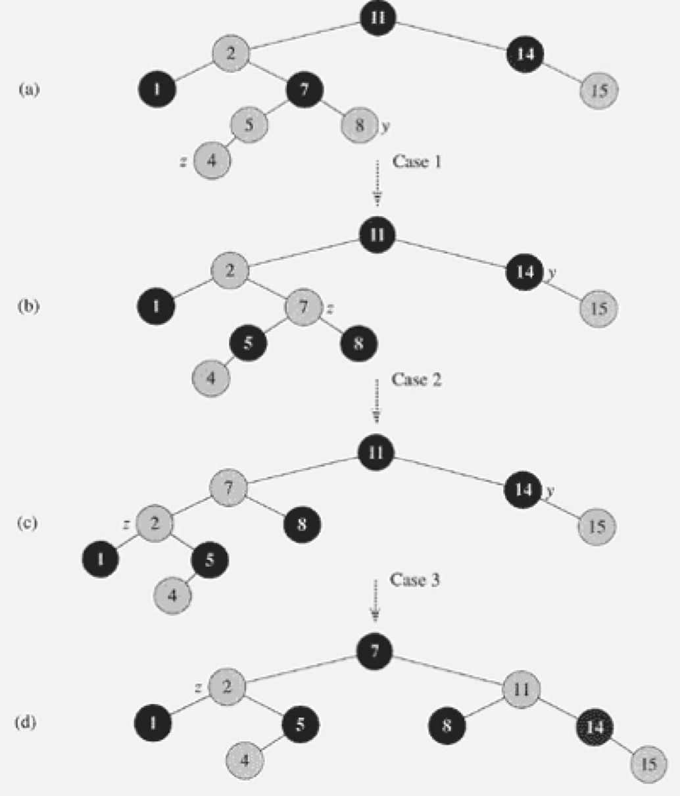
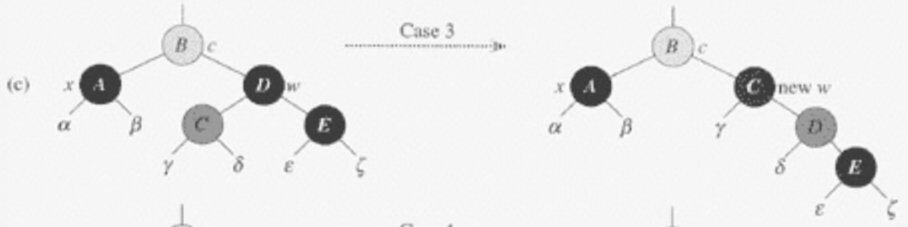

# 레드 - 블랙 트리
- BST의 3가지 기본연산은 트리 높이에 비례하는데, 최악일 경우 O(N)
- 현실에서 정렬된 데이터가 insert가 되면 최악의 경우에 해당할 가능성이 높다.
- BST의 기본 특징은 유지하면서 Tree의 밸런스가 무너지지 않도록 확장한 트리가 RBT 트리이다.
- 각각의 노드가 레드 나 블랙 인 색상 속성을 가지고 있는 이진 탐색 트리이다
- 균형잡힌 트리 (Balanced)라고 불리며, 높이가 O(logN)
    - 최악의 경우라도 O(logN)
    - 다만 insert, delete 연산이 복잡해지는 단점이 있다.
- RBT의 노드는 데이터, left, right, parent 주소 참조를 가진다.
- **특이하게 RBT는 자식 노드가 존재하지 않으면 null을 가지는게 아닌 `NIL 노드`라는 특수노드를 가진다고 가정한다.**
    - **따라서 모든 리프 노드들은 `NIL 노드` 이다.**
- 루트의 부모 노드도 null이 아닌 `NIL 노드`를 가진다고 가정한다.
- 즉, 실제 노드(내부 노드라고도 함)와 `NIL 노드`를 가진다.
    - 설명을 편하게 하기 위한 가상 노드이며 실제 구현을 위한 노드가 아니다. <br>
    


<br>
<br>

## 1. RBT의 조건
- 다음 5가지 조건을 만족하는 BST이다.
1. 각 노드들은 Red or Black 이다.
2. 루트 노드는 항상 반드시 Black이다.
3. 모든 리프 노드(`NIL 노드`)는 Black이다.
4. **Red 노드는 연속해서 등장할 수 없다.**
    - Red 노드의 자식 or 부모는 Black이여야 한다.
    - 부모 - 자식이 Black은 허용한다.
5. **모든 노드에 대해서 어떤 노드로부터 자손인 리프 노드(`NIL 노드`)에 이르기까지 <br>
    모든 경로는 동일한 갯수의 Black 노드가 존재한다.**


<br>
<br>

## 2. RBT의 높이
1. 노드 X의 높이는 자신으로부터 리프 노드(NIL 노드)까지 가장 긴 경로에 포함된 엣지의 갯수
    - 여러 경로가 존재할 경우 그 중 경로의 **최댓값이 높이가 된다.**
2. 노드 X의 블랙-높이는 자신으로부터 리프 노드까지의 경로상에 있는 Black 노드의 갯수이다. (자기자신 포함 X) (NIL 노드 포함 O)
    - 블랙-높이는 자신으로부터 어느 경로로 가든 똑같다. 왜? => RBT 특징 5. <br>
       > 노드 자신으로부터 리프 노드까지에 이르는 모든 경로는 동일한 갯수의 Black 노드가 존재.

3. 높이가 h인 노드의 블랙-높이는 높이의 절반 이상이다.
    - bh(x) >= h(x) / 2
    - RBT 특징 4. <br>
        > Red 노드는 연속해서 등장할 수 없다.

4. 노드 X를 루트로 하는 임의의 서브트리는 **최소 2<sup>bh(x)</sup> - 1**개의 내부 노드를 포함한다. (수학적 귀납법 증명)
    - bh(x) == 0이라면, 노드 X는 NIL 노드라는 뜻. 노드 X를 루트를 하는 서브 트리의 내부 노드 갯수는 최소 2<sup>bh(x)</sup> - 1 = 2<sup>0</sup> - 1 = 0개의 내부 노드를 가진다 (성립)
        ```
            (NIL)
        ```
    - bh(x) == 1이라면, 노드 X자기 자신을 제외한 블랙 노드 갯수가 1개가 있다는 뜻으로, NIL 노드를 가진다. 노드 X를 루트를 하는 서브 트리의 내부 노드 갯수는 최소 2<sup>bh(x)</sup> - 1 = 2<sup>1</sup> - 1 = 1개의 자기 자신 내부 노드를 가진다 (성립)
        ```
            (X)
            /
         (NIL)
        ```
    - bh(x) == 2이라면, 노드 X자기 자신을 제외한 블랙 노드 갯수가 2개가 있다는 뜻으로, 
        ```
                  (X)
                /     \
           (black A) (black B) 
            /   \      /   \     
                
                  ...
        ```
        - X의 두 자식 노드 A,B가 있고 각 자식노드의 블랙-트리 높이는 bh(X)-1이 된다.
        - A의 bh(A)는 2<sup>bh(X) - 1</sup> - 1
        - B의 bh(B)는 2<sup>bh(X) - 1</sup> - 1
        - X가 A만 가지고 있다고 가정하면 A를 루트로하는 서브트리의 노드 갯수는 2<sup>2 - 1</sup> - 1 = 1개 + x노드 1개 = 2개 (성립)
        - X가 A, B 둘다 가지고 있다고 가정하여 X를 루트로 하는 서브트리는 <br>
        2 * (2<sup>bh(X) - 1</sup> - 1) + 1(X) = 2<sup>2</sup> - 1 = 3개의 내부 노드를 가진다 (성립)
5. 위의 두 3,4번 특징으로 설명 가능한 것은 n개의 내부노드를 가지는 레드블랙트리의 높이는 2log(n+1) 이하이다.
    - n >= 2<sup>bh</sup> - 1 >= 2<sup>h/2</sup> - 1 이므로, 여기서 bh와 h는 각각 루트 노드의 블랙-높이와 높이
    - n >= 2<sup>h/2</sup> - 1  
    - n + 1 >= 2<sup>h/2</sup>
    - log(N+1) >= h/2
    - 2log(N+1) >= h

<br>
<br>

## 3. 회전
- search 연산은 BST와 같다.
- insert, delete 연산을 알기전에 회전 연산을 배워야 한다.
- 회전은 한 노드를 중심으로 부분적으로 노드의 모양을 수정하는 것.
- 시간 복잡도 : O(1)


<br>

- **회전 연산을 하고나서도 BST의 특징을 유지한다.**
    - α는 원래 x보다 작음, LR연산 후에도 α는 x보다 작음 
    - γ는 원래 y보다 큼, LR연산 후에도 γ는 y보다 큼
    - β는 원래 x보다 크고 y보다 작음, LR연산 후에도 β는 x보다 크고 y보다 작음

- LR pseudo
    - x.right가 NIL NODE가 아니라고 가정
    - rootNode의 부모도 NIL NODE가 아니라고 가정
```
leftRotate(tree, node) {
    // 01
    y = x.right; // x의 오른쪽 자식 노드를 y에 저장한다.
    x.right = y.left // x의 오른쪽 자식노드를 β로 만든다.

    // 02
    y.left.parent = x; // β의 부모 노드를 x로, y와의 연결 제거
    y.parent = x.parent // y의 부모노드를 현재 x의 부모 노드로

    // 03
    if (x.parent instanceof NIL_NODE) { // x가 루트노드라면
        tree.rootNode = y;
    } else if (x == x.parent.left) { // x의 부모노드가 존재하고 x가 부모노드의 왼쪽 자식이였다면
        x.parent.left = y; // y가 x부모노드의 왼쪽 자식노드가 된다.
    } else {
        x.parent.right =y; // 그렇지 않다면, y는 x의 부모노드의 오른쪽 자식이 된다.
    }
    
    // 04
    y.left = x;    // x가 y의 왼쪽 자식이 되고
    x.parent = y; // y가 x의 부모노드가 된다.
}

01.
         x                                x   
       /    \                            /  \  
      α      y            --------->    α    \    y  
            / \                               \ /   \
           β   γ                               β     γ

02.       parent                            parent
          /                                 /   |
         x                                x     |
       /  \                              /  \   | 
      α    \    y         --------->    α    β  y
            \ /   \                              \
             β     γ                              γ

03.       parent                            parent
          /   |                             /      
         x    |                            y        x
       /  \   |           --------->        \      /  \
      α    β  y                              γ    α    β
               \
                γ  

04.      parent                            parent
         /                                 /
        y        x        --------->      y
         \      /  \                    /  \
          γ    α    β                  x    γ 
                                      /   \
                                     α     β 
```


<br>
<br>

## 4. 삽입
- 보통 BST처럼 노드를 insert한다.
- 차이점은 새로운 노드를 RED노드로 인식하고 새로운 노드의 부모가 RED노드일 수도 있기 때문에 <br>
RBT의 조건을 조정하기 위해 fixup이라는 메서드를 호출하여 조정한다.
- 시간 복잡도 : O(logN)
    - insertFixUp에서 Case 1, 4에 해당할 경우 newNode가 2레벨 상승한다.
    - Case 2, 3, 5, 6에 해당할 경우 O(1)
    - 트리의 높이보다 더 많은 시간을 필요로 하지 않기 때문에 트리의 높이에 비례하는 시간복잡도를 가진다.
- pseudo
```
insert(tree, newNode) {
    x = rootNode;
    y = NIL_NODE (null); // y = x of parent;
    // 또다른 포인터 y를 사용해서 y가 x의 한칸 뒤를 쫓아 내려오록 해야 새로운 노드를 insert할 자리를 관리할 수 있다.

    // 새로운 노드가 들어갈 자리를 찾는다.
    while (x != null) {
        y = x;
        if (newNode.data < x.data) {
            x = x.left;
        } else {
            x = x.rightl
        }
    }

    newNode.parent = y;
    if (y == null) { // while문을 한번도 실행하지 못하면 emptyTree라는 
        tree.rootNode = newNode;
    } else if (newNode.data < y.data) {
        y.left = newNode;
    } else {
        y.right = newNode;
    }
    // 여기까지 일반 bst와 같다.

    newNode.left = NIL_NODE (null);
    newNode.right = NIL_NODE (null);
    newNode.color = RED;
    insertFixup(tree, newNode);
}
```

<br>
                  
### 4.1 INSERT - FIXUP
- RBT의 조건이 위반될 수 있는 조건들
     1. ~~각 노드들은 Red or Black 이다.~~
        - **위반 가능성 없음**
     2. 루트 노드는 항상 반드시 Black이다.
        - 만약 새로운 노드가 RED노드로 해줬기 때문에 루트노드가 된다면 위반된다.
        - 이런 경우는 그냥 루트 노드를 Black으로 바꿔주면 된다.
     3. ~~모든 리프 노드(`NIL 노드`)는 Black이다.~~
        - **위반 가능성 없음**
     4. Red 노드는 연속해서 등장할 수 없다.
        - **부모 노드가 원래 RED였다면, RED - RED 가 되므로 위반이 발생한다.**
     5. ~~모든 노드에 대해서 어떤 노드로부터 자손인 리프 노드(`NIL 노드`)에 이르기까지 <br>
         모든 경로는 동일한 갯수의 Black 노드가 존재한다.~~
        - **위반 가능성 없음**
- Loop Invariant
    - 위의 문제들을 Loop를 돌면서 문제를 해결할건데, 루프 도는동안 변하지 않고 유지되는 조건들을 파악해보자.
    1. New Node는 RED 노드이다.
    2. 오직 하나의 위반만이 존재한다.
        - 조건 2 : New Node가 루트이면서 RED
        - 조건 4 : New Node와 New Node의 부모 둘다 RED인 경우
    - 조건 4를 해결하기 위해 루프로 부모노드를 계속 타고 올라간다. 계속 올라가다 보면, 또 다른 RED - RED 위반이 있을 수 있다. <br>
    최악의 경우 루트노드까지 타고올라가게 되면, 조건 2를 위반 한 것이므로 루트노드를 블랙으로 바꿔주고 종료하면 된다.
    - 종료 조건 : newNode.parent가 black이 되면 종료한다. 조건 2가 위반일 경우 블랙으로 바꿔주고 종료한다.

- 위반된 문제들을 6가지 케이스로 나눈다.
    - 1, 2, 3 Case는 NewNode.parent가 NewNode.parent.parent의 왼쪽 자식인 경우
    - 4, 5, 6 Case는 NewNode.parent가 NewNode.parent.parent의 오른쪽 자식인 경우
    - NewNode.parent.parent가 반드시 존재하는 이유는 RED-RED 위반시 NewNode.parent도 RED 노드이므로 <br>
    NewNode.parent.parent는 블랙노드라는 소리 이므로 존재할 수 밖에 없다.
- case 1,2,3과 4,5,6은 대칭적이다.

#### CASE 1 : NewNode의 부모 형제가 RED


<br>

- 현재 B 노드가 우리가 새로 insert한 New Node라고 가정해보자.
- A, B 노드 두개다 RED 노드 일경우, D 노드도 RED 노드여야 한다.
1. newNode의 부모와 부모형제 컬러와 newNode.parent.parent 컬러를 바꾼다.
    - 즉 newNode의 부모와 부모형제 컬러를 black으로
    - newNode.parent.parent 컬러를 red로
2. 할아버지 노드가 RED로 바뀌었을때, 할아버지의 부모도 RED일경우 해당 위치에서 해당 case에 맞는 연산을 수행한다.
 
#### CASE 2, 3 : NewNode의 부모 형제가 Black


<br>

- NewNode의 부모형제가 NIL_NODE 일 수도 있다.
- case 2 : newNode가 오른쪽 자식인 경우
    - newNode.parent에 대해서 LR연산을 수행하여 case 3과 같은 상황으로 맞춘다.
- case 3 : newNode가 왼쪽 자식인 경우
    - newNode.parent 색을 Black, newNode.parent.parent를 RED로 바꾼다.
    - newNode.parent.parent에 대해서 RR 연산을 수행한다.
    
#### CASE 1, 2, 3 정리
- Case 1의 문제를 해결하고 나면 문제는 종료되지 않는다. Case 2로 갈수도 있고, Case 3로 갈수도 있으며, 다시 Case 1의 문제가 반복해서 발생할 수 있다. <br>
최악의 경우 루트노드까지 올라가서 RBT의 조건 2 루트 노드가 레드인 경우를 블랙으로 변경하면서 종료하게 된다.
- Case 2는 발생하면, Case 3을 거쳐서 해결하면 종료된다.
- Case 3의 경우 z의 할아버지 노드를 기준으로 RR하면 문제가 해결되고, 종료 된다.
- Case 1, 2, 3의 경우에 해당하는 것이고, Case 1에서 Case 4, 5, 6으로 넘어갈 수도 있다.

#### CASE 4, 5, 6
- Case 1, 2, 3은 newNode.parent가 newNode.parent.parent의 왼쪽 자식인 경우들
- Case 4, 5, 6은 newNode.parent가 newNode.parent.parent의 오른쪽 자식인 경우들
- 결론적으로 Case 1, 2, 3과 대칭적이므로 4, 5, 6과 매칭이 된다.
- Case 4의 문제를 해결하고 나면 문제가 해결된 것이 아니고, Case 4로 다시, 또는 Case 5, 6으로, Case 1, 2, 3으로 넘어갈 수도 있다.
- Case 5의 경우 Case 6을 거쳐서 해결하면 종료된다.

#### Insert Fixup 흐름


<br>

- (a) : 새로운 노드(4)일 경우, 4의 부모가 할아버지의 왼쪽이므로 CASE 1,2,3중 하나에 해당하는데 4의 부모 형제 노드인 8이 RED이므로 CASE 1에 해당
- (b) : 
    - 4의 부모(5)와 형제 노드(8)의 색을 Black으로, 4의 할아버지(7)를 RED로 바꾼다. 
    - 4의 할아버지(7)과 할아버지 부모(2)가 서로 RED-RED 위반하게 되어 할아버지 노드(7)을 새로운 노드로 관리한다.
    - 새로운 노드(7)의 부모(2)가 할아버지(11)의 왼쪽이므로 또 CASE 1,2,3 중 하나에 해당한다. 
    - 새로운 노드(7)의 부모(2) 형제(14)가 Black이고, 새로운 노드(7)가 부모(2)의 오른쪽에 해당하므로 CASE 2에 해당한다.
- (c) : 2의 부모 기준(7)으로 LR연산 수행
- (d) : 
    - CASE 3에 해당하여 2의 부모(7) 색을 Black, 2의 할아버지(11)를 RED로 바꾼다.
    - 2의 할아버지 11(기준)으로 RR연산 수행
 
#### Insert Fixup pseudo
```
insertFixUp(tree, newNode) { 
    /*
        newNode의 부모가 RED인 경우 위반이 존재하여, 위반이 존재할때까지 루프.
        newNode가 루트 노드가 되더라도 루트의 부모는 null(NIL NODE)이기에 탈출
     */
    while (newNode.parent.color == RED && newNode.parent != null) {
        // case 1,2,3은 newNode의 할아버지 왼쪽 자식 노드가 newNode의 부모노드 인경우임
        // 즉 해당 조건문은 case 1,2,3
        if (newNode.parent == newNode.parent.parent.left) {
            brotherNode = newNode.parent.parent.right;
            // CASE 1
            if (brotherNode.color == RED) { 
                newNode.parent.color = BALCK;
                brotherNode.color = BALCK;
                newNode.parent.parent = RED;
                newNode = newNode.parent.parent;
            } else { // CASE 2, 3 => brotherNode.color == BLACK
                // CASE 2
                if (newNode == newNode.parent.right) { 
                    newNode = newNode.parent; 
                    leftRotate(tree, newNode);
                }
                // CASE 3
                newNode.parent.color = BLACK;
                newNode.parent.parent.color = RED;
                rightRotate(tree, newNode.parent.parent);
            }
        } else { // case 4,5,6임. case 1,2,3 코드에서 right와 left만 바꿔주면 된다.
            ...
        }
    }

    // root가 red인 상횡에서 whlie문을 빠져나올 수 있기 때문에
    tree.rootNode.color = BLACK;
}
```

<br>
<br>

## 5. 삭제
- 보통 BST처럼 노드를 delete한다.
- 실제로 삭제된 노드가 RED였으면 종료. <br>
실제로 삭제된 노드가 BLACK이라면 RBT의 조건을 조정하기 위해 fixup이라는 메서드를 호출하여 조정한다.
- pseudo
```
delete(tree, target) {
    // 자식 노드가 0개이거나 1개라면
    if (target != null && (target.left == null || target.right == null) {
        // 실제로 삭제할 temp 변수에 옮긴다.
        temp = target;
    } else {
        // 자식 노드가 2개라면 후행자를 찾는다.
        temp = successor(target);
    }

    /* 
        temp의 자식을 체크하는 이유는 temp가 삭제가 될것이기 떄문에
        temp의 자식을 temp 위치로 옮겨 temp의 부모와 연결하기 위함
    */
    if (temp.left != null) { 
        child = temp.left;
    } else {
        child = temp.right;
    }

    if (child != null) {
        child.parent = temp.parent;
    }

    // 삭제할 부모 노드의 자식 링크들을 변경하는 부분
    if (temp.parent == null) { // temp가 루트노드라면 
        tree.rootNode = child;
    } else if (temp.parent.left == temp) { // 삭제할 노드가 삭제할 부모의 왼쪽노드라면
        temp.parent.left = child; // 왼쪽 child로 참조 변경
    } else {
        temp.parent.right = child; // 오른쪽 child로 참조 변경
    }
    
    /*
         case 3, 위에서 자식이 0,1개면 temp를 그대로 쓰지만 2개면 선행자를 가짐
        후행자의 값을 삭제하려는 노드로 값을 옮긴다.
    */
    if (target != temp) {
        target.data = temp.data;
    }

    /*
        삭제한 노드가 RED이면 규칙에 위반되지 않아 종료
        삭제한 노드가 BLACK이라면 규칙에 위반되어 fixup
        - 삭제한 노드가 루트 노드인데 그 자리에 자식이 올라왔을때 자식이 RED일 경우
        - RED - BLACK - RED의 구조에서 중간 Black 노드가 삭제가 되어 RED - RED가 연속될 수도 있다.
            - 중간에 BLACK이 없어졌으므로 모든 경로에서 블랙노드 갯수가 일치한다는 조건이 성립되지 않는다.
        - 이미 temp는 삭제했으므로, temp의 자식인 child를 파라미터로 넘긴다.
     */
    if (temp.color == BLACK) {
        deleteFixup(tree, child);
    }
    return temp;
}
```

### 5.1 DELETE FIXUP
- **파라미터로 넘어온 삭제한 노드의 child는 NIL 노드 일 수 있다.**
- **파라미터로 넘어온 삭제한 노드의 child가 RED 노드일 경우 해결하기 쉽다.**
    - BLACK으로 바꿔버리면 끝
- 파라미터로 넘어온 삭제한 노드의 child가 BLACK일 경우가 해결과정이 복잡하다.
- 위반이 될 수 있는 규칙은 다음과 같다.
    - 루트 노드는 Black이다. <br>
      만약 삭제한 노드가 루트였고, child가 RED인 경우 위반된다. BLACK으로 바꿔버리면 끝
    - RED - BLACK - RED의 구조에서 중간 Black 노드가 삭제가 되어 RED - RED가 연속될 수도 있다.<br>
      child를 BLACK으로 바꾸면 끝
    - **모든 노드에 대해서 그 노드로부터 자손인 리프 노드에 이르는 모든 경로엔 동일한 BLACK 노드의 갯수가 존재한다.**
        - **RED - BLACK - RED의 구조에서 중간 Black 노드가 삭제가 되어 삭제한 노드를 포함한 모든 경로는 BLACK 노드 하나가 부족해졌다.**

### 5.2 문제 해결
- 위에 마지막에 언급된 경로상 동일 BLACK노드의 갯수가 달라지는 문제는 다음과 같이 해결한다.
    - 노드 child에 Extra Black이라는 가상의 BLACK 노드를 부여하여 조건 5를 만족하도록 한다.
        - 즉, 노드 child는 검은색을 두개 가지고 있게 하는 임시 방법이다. (자식 개념이 아님)
        - 노드 child는 Double Black 혹은 Red & Black이 된다.
    - **문제 해결의 종료조건은 해당 Double Black 혹은 Red & Black를 일반적인 Black 노드로 바꾸는 것**
- Double Black인 상태에서 extra BLACK을 위쪽으로 올려보낸다. 올리다보면 부모가 RED 노드여서 Red & Black이 될 경우 해당 RED를 제거한다. 
- 만약 최악으로 트리 위쪽까지 전부 BLACK일 경우 루트 노드까지 올리게 된다. 루트 노드가 Double Black이 되면 Extra Black을 제거한다.

<br>

- Loop Invariant
    - 노드 child는 루트가 아닌 Double Black 노드
    - **노드 child의 형제 노드를 Bro Node라고 할때, Bro 노드는 NIL 노드가 될 수 없다.**
        - NIL 노드가 된다면 child 노드의 부모에 대해 조건5가 위배된다.

<br>

- DELETE의 경우 8가지 case로 분류된다.
    - insert와 마찬가지로 1,2,3,4 / 5,6,7,8은 대칭이다.
- CASE 1,2,3,4 : 노드 child가 부모의 왼쪽 자식일 경우
- CASE 5,6,7,8 : 노드 child가 부모의 오른쪽 자식일 경우

#### CASE 1 - child의 형제 노드 bro가 RED인 경우
- Bro 노드는 자식노드가 NIL 노드가 아닌 BLACK 노드 이다.
    - Case 1인 경우 Bro 노드의 자식노드가 NIL 노드라면 조건5가 위배된다.
- Bro 노드의 색을 BLACK으로, child 노드의 부모 노드를 RED로 바꾼 뒤, child의 부모 노드에 대해 Left Rotation을 수행한다.
- LR을 수행하고나면 child 노드는 여전히 Double Black이며 레벨 하나가 낮아지게 된다. Extra Black 노드를 올리기 위한 2보전진을 위한 1보 후퇴이다.
- child의 새로운 형제 노드는 원래 Bro 노드의 자식 노드가 오게된다.
- 새로운 Bro 노드가 RED가 아닌 BLACK이므로, Case 2 or 3 or 4로 넘어간다. <br>


<br>

#### CASE 2 - Bro가 Black, Bro의 자식들도 Black
- Case 2,3,4는 Bro 노드가 Black 이다.
- Case 1을 거쳐오는건지, 바로 Case 2로 오는건지 알 수 없기 때문에 child의 부모가 RED인지 BLACK인지 알 수 없다.
    - Case 1로 진입한 경우, child의 부모는 RED, 바로 진입한 경우는 BLACK
- 현재 child는 Double Black, Bro는 Black이므로, 이 상황에서 child와 Bro 노드의 Black을 하나씩 뺏고 부모 노드에게 전달한다.
- child는 Extra Black 하나를 위로 올리게 되어 (뺏기게 되어) 일반적인 Black 노드가 된다.
    - child의 부모에게 Extra Black을 넘겨주어 조건 5가 충족된다. 
- Bro 노드는 Black을 빼앗겨서 Red가 된다.
- child의 부모가 RED일 경우, Red & Black이 되어 RED를 제거하고 BLACK으로 변경한다.
    - child는 일반 BLACK노드가 되어 fixup이 종료된다.
- child의 부모가 BLACK일 경우 부모 노드를 새로운 child로 간주하고 다시 해당되는 case를 수행한다. <br>


<br>

#### CASE 3 - Bro가 Black, Bro의 왼쪽 자식이 RED (오른쪽은 Black)
- Bro 노드 색을 RED로, Bro 노드의 왼쪽 자식 색을 Black으로
- Bro 노드에 대해서 Right Rotation 연산 수행
- 연산 수행 후 child의 형제가 새로 바뀌고 바뀐 Bro 노드의 오른쪽 자식은 RED가 되어 CASE 4를 수행한다. <br>



<br>

#### CASE 4 - Bro가 Black, Bro의 오른쪽 자식이 RED (왼쪽은 Black)
- Bro의 색을 child.parent색으로 변경
- child.parent의 색을 BLACK으로 변경
- child.parent에 대해 Left Rotation을 수행
- child의 Extra Black을 제거하고 child를 루트 노드로 변경하고 종료
    - 기존의 child 노드를 지나는 Black 노드의 갯수는 로테이션 전과 같다.
    - 루트 노드로 변경하게 되면 로직에 의해 종료됨.;

<br>


<br>

#### Delete Fixup CASE 흐름
 <br>


<br>

- pseudo
```
deleteFixup(tree, child) {
    // 루트 노드 그리고 RED가 아닐때만 수행 (RED라면 바로 while문을 벗어나서 BLACK으로 바꿔주는 연산 수행)
    while (child != tree.rootNode && child.color != BLACK) {

        // child가 parent의 왼쪽 자식이면 CASE 1,2,3,4
        if (child.parent.left == child) {
            broNode = child.parent.right;

            // CASE 1
            if (broNode.color == RED) { 
                broNode.color = BLACK;
                broNode.parent.color = RED;
                leftRotation(tree, bro.parent);
                broNode = child.parent.right;
            }

            
            if (broNode.color == BLACK) {
                // CASE 2
                if (broNode.left.color == BLACK && broNode.right.color == BLACK) {
                    broNode.color = RED;
                    child = child.parent;
                } else {
                    // CASE 3
                    if (broNode.left.color = RED) {
                        broNode.color = RED;
                        broNode.left.color = BLACK;
                        rightRotation(tree, broNode);
                        broNode = child.parent.right;
                    }
                    
                    // CASE 4
                    broNode.color = child.parent.color;
                    child.parent.color = BLACK;
                    bro.right.color = BLACK;
                    leftRotation(tree, child.parent);
                    child = tree.rootNode;
                }
            }
        } else { // case 5, 6, 7 8
            // right <-> left
        }
    }
    child.color = BLACK;
}
```
- 시간복잡도
    - DELETE : O(logN)
    - FIX UP : O(logN)
    - 가장 최악인 경우는 case 2, 6이 반복되는 경우인데, 최대 트리 높이만큼 실행된다.
    - 그래서 DELETE + FIX UP을 수행해도 최대 O(logN)


      
      
   
