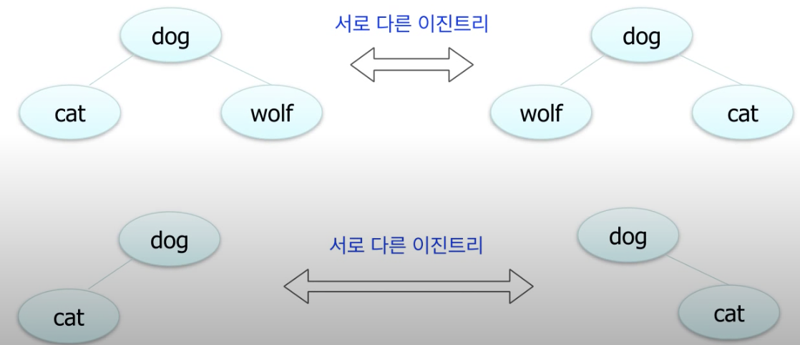
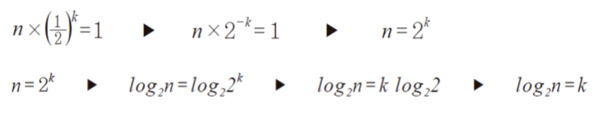
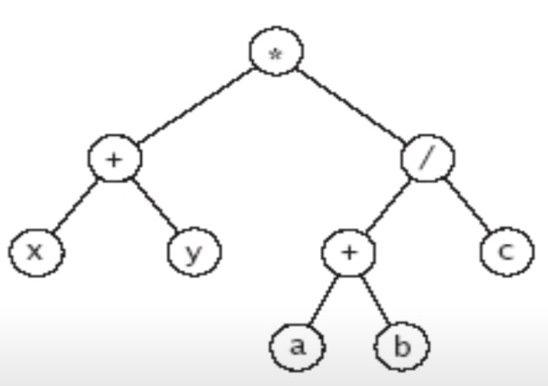
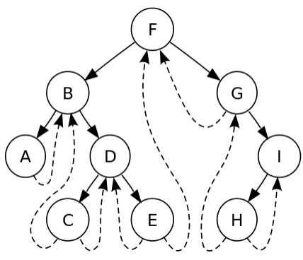
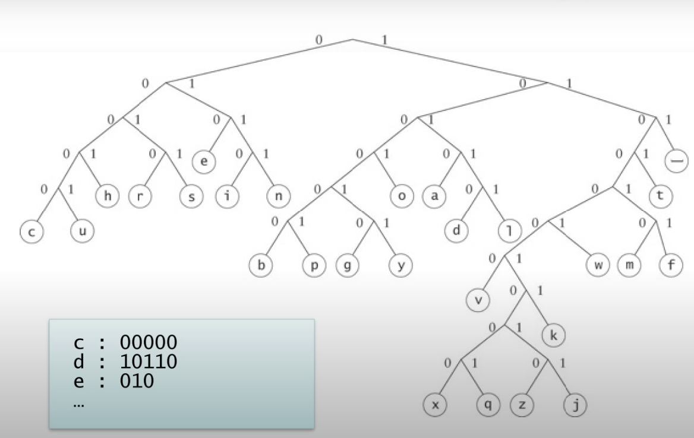

# 트리와 이진트리

<br>

## 트리
- 계층적인 구조를 표현하는 자료구조
- 간단한 예로 조직도, 디렉토리, 가계도 등을 말할 수 있다.

### 트리에 사용되는 용어
- 루트 노드 : 맨 위의 노드를 루트 노드라고 한다.
- 리프 노드 : 자식이 없는 노드
- 서브 트리 : 전체 트리중 일부분의 한 노드와 그 노드의 자손들은 트리구조를 가지고 있다.
- 레벨 : 트리의 특정 깊이
- 높이 : 가장 깊숙히 있는 노드의 깊이

### 트리의 특징
- 트리는 노드 와 노드들을 연결하는 링크들로 구성된다.
- 부모 - 자식 관계 혹은 조상 - 자손 관계를 가진다.
- 부모가 동일한 노드들은 서로 형제 관계라고 한다.
- 루트 노드를 제외한 모든 노드들은 부모 노드를 가진다.
- 노드가 N개인 트리는 항상 N-1개의 링크를 가진다.
- 루트 노드에서 어떤 임의의 노드로 가는 길은 유일, 존재한다.
    - 임의의 한 노드에서 다른 노드로 가는 경로는 공통 조상노드들을 만날 수 밖에 없으므로

<br><br>

## 이진 트리
- 각 노드가 최대 2개의 자식을 가진다. 한개만 가질수도, 없을수도 있다는 뜻<br>
 
<br>

- 각 자식 노드는 부모의 왼쪽 자식인지 오른쪽 자식인지 지정되어있다.
    - 자식이 한개일지라도 정해져있다.

### Full Binary Tree, Complete Binary Tree
- Full Binary Tree
    - 모든 레벨에 노드가 꽉 찬 트리
    - 높이가 h일때 2^h - 1개의 노드를 가진다.
- Complete Binary Tree
    - 맨 마지막 레벨을 제외한 모든 레벨의 노드들은 꽉 차 있는 트리
    - 맨 마지막 레벨은 맨 오른쪽에서 부터 비어져 있어야 한다.     
- 노드가 N개인 Full, Complete Binary Tree의 높이는 O(logN)
    - 처음에 데이터 수가 n개일 때의 탐색과정에서 1회의 비교연산 진행
    - 데이터 수를 반으로 줄여서 그 수가 n/2개일 때의 탐색과정에서 1회 비교연산 진행
    - 데이터 수를 반으로 줄여서 그 수가 n/4개일 때의 탐색과정에서 1회 비교연산 진행
    - 데이터 수를 반으로 줄여서 그 수가 n/8개일 때의 탐색과정에서 1회 비교연산 진행
    - 데이터 수를 반으로 줄여서 그 수가 1개일 때의 탐색과정에서 1회 비교연산 진행
    - 무수히 많이 진행 되기때문에 일단 n의 갯수를 8 이라 가정하고 정리를 해보자
    - 반으로 줄여서 그 수가 1개일때의 탐색과정<br>
      데이터의 수가 8이면<br>
      1번 했을때 8<br>
      2번 했을때 8/2<br>
      3번 했을때 8/4<br>
      4번 했을때 8/8<br>
      이 되어 총 4번의 비교연산(k)이 진행되었다는걸 알 수있다.<br>
      <br>
      8이 1이 되기까지 2로 나눈횟수는 3회 즉, 비교연산 3회를 진행<br>
      데이터가 1개 남있을때, 마지막으로 비교연산을 진행해서 1회 진행<br>
      
      이제 이 8을 n으로 지정하여 바꿔주면<br>
      n이 1이 되기까지 2로 나눈횟수는 k회 즉, `비교연산 k회`를 진행<br>
      데이터가 1개 남있을때, 마지막으로 비교연산을 진행해서 1회 진행으로 설명할 수 있다.<br> 
      이에 대한 시간복잡도 함수를 T(n) = k+1 으로 할 수 있다.<br> 
     
      앞서 k를 n이 1이되기까지 2로 나눈다고 했으니 이를 식으로 표현한다.<br>        
      `N * (1/2)^k  = 1`<br><br> 
     
      K에 관한 식으로 정의 한다면 <br>
      
      <br>
      **즉 `평균 시간 복잡도는 O(logN)`, n이 증가함에 따라서 비교연산의 횟수가 로그적으로 증가한다는것** 
- 다음과 같이 노드가 N개인 이진트리의 높이는 `최악의 경우 O(N)`이 될 수 있다.
- 한쪽으로 기울어진 트리를 사향 or 편향 트리라고 한다.
    ```
            o
          /
         o
        /
       o
      /
     o
    ```

<br>

- 그러므로 `평균 시간 복잡도 O(logN)`와 `최악의 시간복잡도 O(N)` 둘 다 말할 수 있어야 한다.
- example
```
   최선 O(logN)             최악 O(N)
     4                       1
    /  \                       \
   2    5                       2
 /  \  /  \                       \
1   3  6   7                       3
                                    \
                                     4
                                      \
                                       5
                                        \
                                         6
                                          \
                                           7      
```

### 이진 트리 순회
- 이진 트리는 각 노드들을 연결 구조로 표현한다.
- 노드는 데이터, 왼쪽 자식의 주소, 오른쪽 자식의 주소, 부모 노드의 주소로 구성된다.
    - 보통 루트에서 밑으로 내려가는 경우라면 부모 노드의 주소는 보통 생략한다.
    - 루트 노드의 주소는 따로 보관해야 한다.
- 순회 (Traversal) : 이진 트리의 모든 노드를 방문하는 일, 대표적인 3가지 방법과 그외 1가지 방법이 존재한다.
    - 중순위 순회 (In-Order)  
    - 선순위 순회 (Pre-Order)
    - 후순위 순회 (Post-Order)
    - 레벨오더 순회 (Level-Order)
- 순회시 세 부분으로 나누고 시작한다. 루트 노드, 루트 노드의 왼쪽 서브트리(T-L), 루트 노드의 오른쪽 서브 트리(T-R)  
- 3가지의 순회는 세 부분중 어느 부분부터 시작하냐에 따라 나눠진다.
- 순회는 본질적으로 재귀적인 특성을 가지고 있다.
- 각 순회의 시간 복잡도는 `O(N)`이다.
- T (n) = 2 * T (n / 2) + 1
    - 왼쪽 서브 트리의 경우 = T (n / 2)
    - 오른쪽 하위 트리의 경우 = T (n / 2)
    - 기본 확인의 경우 1

#### 중순위 순회 (In-Order)
1. T-L을 먼저 순회
2. 루트 노드 순회
3. T-R 순회

- example
```
    5                       2
   / \                       \
  3   7                       3
 / \  / \                      \
2  5 1   8                      7
                               /  \
                              5    8
                             /
                            5


2-3-5-5-1-7-8           2-3-5-5-7-8        
```
- pseudo
```
// 처음은 rootNode를 인자로
inOrderTraversal(node) {
    if (node == null) {
        return;
    }
    inorderTraversal(node.left);
    print(node); 
    inorderTraversal(node.right);
}
```

<br>

#### 선순위 순회 (Pre-Order)
1. 루트 노드를 먼저 순회
2. T-L 순회
3. T-R 순회

- example
```
    5                       2
   / \                       \
  3   7                       3
 / \  / \                      \
2  5 1   8                      7
                               /  \
                              5    8
                             /
                            5


5-3-2-5-7-1-8           2-3-7-5-5-8        
```
- pseudo
```
// 처음은 rootNode를 인자로
preOrderTraversal(node) {
    if (node == null) {
        return;
    }
    print(node); 
    preorderTraversal(node.left);
    preorderTraversal(node.right);
}
```

<br>

#### 후순위 순회 (Post-Order)
1. T-L를 먼저 순회
2. T-R 순회
3. 루트 노드 순회

- example
```
    5                       2
   / \                       \
  3   7                       3
 / \  / \                      \
2  5 1   8                      7
                               /  \
                              5    8
                             /
                            5


2-5-3-1-8-7-5           5-5-8-7-3-2      
```
- pseudo
```
// 처음은 rootNode를 인자로
postOrderTraversal(node) {
    if (node == null) {
        return;
    }
     
    preorderTraversal(node.left);
    preorderTraversal(node.right);
    print(node);
}
```

<br>

#### 레벨-오더 순회 (Level-Order)
- 노드 레벨 순으로 방문, 동일 레벨에서는 왼쪽에서 오른쪽으로 순회
- Queue를 이용하여 구현한다.
- example
```
    3                       
   / \                       
  1   5                       
 / \ / \                      
0  2 4  6                      
  / \                            
 7   8                          
                           
3 1 5 0 2 4 6 7 8  

1. 루트 노드 3을 Queue에 넣는다. 
    -> Queue = 3
2. 3을 꺼내고 출력, 꺼낸 노드의 자식 노드를 접근하여 Queue에 넣는다.
    -> Queue = 1 5
    -> Print = 3  
3. 1을 꺼내고 출력, 꺼낸 노드의 자식 노드를 접근하여 Queue에 넣는다.
    -> Queue = 5 0 2
    -> Print = 3 1 
4. 5을 꺼내고 출력, 꺼낸 노드의 자식 노드를 접근하여 Queue에 넣는다.
    -> Queue = 0 2 4 6
    -> Print = 3 1 5  
.
.
.

n. Queue가 비면 종료
```
- pseudo
```
levelOrderTraversal() {
    Queue.enqueue(rootNode);
    while(!Queue.isEmpty()) {
        Node = Queue.dequeue();
        print(Node);
        Queue.enqueue(Node.childs);
    }  
}
```
<br>


### 이진 트리의 응용
1. 수식 트리 <br>
    
    <br>
    - 서브트리 시작과 중료시에 괄호를 열고 닫는다.
    - 중순위 순회 (In-Order) &nbsp;&nbsp;&nbsp; : &nbsp; (x + y) * ( (a + b) / c)
    - 전순위 순회 (Pre-Order) &nbsp; : &nbsp;* (+ x y) (/ (+ a b) c)
    - 후순위 순회 (Post-Order) : &nbsp; (x y +) ( (a b +) c /)

2. 쓰레드 이진 트리 <br>
    
    <br>
    
    ```
    (그림엔 없지만) 
    A의 중위 선행자 : F       C의 중위 선행자 : B
    A의 중위 후행자 : B       C의 중위 후행자 : D
    ```
    - 이진 트리의 단점이라고 하면 실제로 사용하는 링크 수보다 사용하지 않는 null 링크가 더 많다는 것.
    - 이런 문제점을 개선하고자 가리키는 곳이 없는 모든 `오른쪽 널 노드 포인터를 중위 후속자 노드`로 연결하고,<br>
     가리키는 곳이 없는 모든 `왼쪽 널 노드 포인터를 중위 선행자 노드`로 연결한 것을 말하며, 재귀적인 중위 순회를 빠르게 할 수 있는 방법이다.
        - 스택 공간을 쓸 수 없거나, 부모 노드의 위치를 알 수 없을 때 유용하게 사용될 수 있다.
    - **널 노드 포인터에 중위 선행자, 후행자가 없다면 RootNode를 참조하도록 한다.**
    - **OS, 프로세스에 관련된 쓰레드가 아님!!**
    - 쓰레드 이진 트리는 `중위 순회`를 기본으로 사용한다.
    - 쓰레드 이진 트리의 구성
    ```java
    class Node<T> {
        boolean hasLeftThread;
        boolean hasRightThread;
        T data;
        Node leftNode;
        Node rightNode;
    }
    // 좌·우측 node가 false일 경우에는 선행, 후행노드를 가리킨다. 
    // 좌·우측이 true일 경우에는 정상적으로 일반적인 좌우 자식노드를 가리킨다.
    ```

3. 허프만 코드 <br>
    
    <br>
    - 허프만 코드 : 데이터 압축, 인코딩시 사용하는 알고리즘
        - 예로 text파일 내용들이 알파벳 a ~ z로 구성되었을때 <br>
     각 알파벳을 인코딩했을때 최종적으로 파일의 길이가 최소가 되도록 하는 것.
